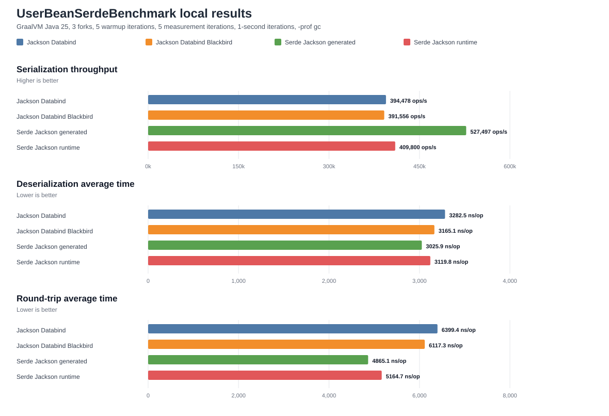
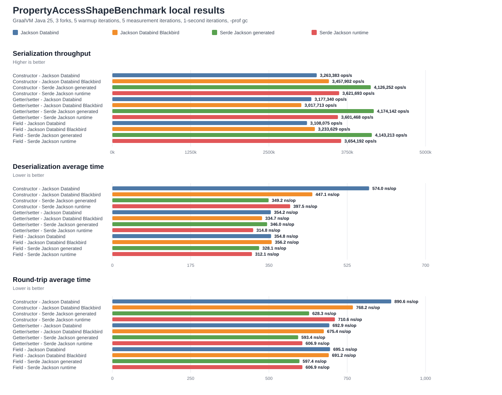

# Serialization Benchmarks Runbook

This module contains JMH microbenchmarks for Micronaut Serialization
performance. The configured benchmark task currently includes:

- `io.micronaut.serde.StartupBenchmark`
- `io.micronaut.serde.SourceGenRoutingBenchmark`
- `io.micronaut.serde.UserBeanSerdeBenchmark`
- `io.micronaut.serde.PropertyAccessShapeBenchmark`
- `io.micronaut.serde.PropertyAccessOrderBenchmark`
- `io.micronaut.serde.PropertyValueKindBenchmark`
- `io.micronaut.serde.PropertyValueKindSerializationCeilingBenchmark`
- `io.micronaut.serde.PropertyValueKindSerializationLifecycleBenchmark`
- `io.micronaut.serde.BeanIntrospectionAccessBenchmark`
- `io.micronaut.serde.SpecificObjectDeserializerComplexShapeBenchmark`

Additional benchmark sources may exist for focused local investigation, but
the checked-in results below are limited to Micronaut Serialization and Jackson
Databind/Blackbird comparisons.

## Run

From repository root:

```bash
./gradlew :micronaut-benchmarks:jmh
```

To build the standalone JMH jar and run a focused local benchmark:

```bash
./gradlew -q :micronaut-benchmarks:jmhJar
repo=$PWD
tmpdir=$(mktemp -d /tmp/mn-jmh.XXXXXX)
cd "$tmpdir"
jar xf "$repo/benchmarks/build/libs/micronaut-benchmarks-3.0.1-SNAPSHOT-jmh.jar"
java -cp "$tmpdir:$tmpdir/*" org.openjdk.jmh.Main '.*UserBeanSerdeBenchmark.*' -wi 5 -i 10 -f 3 -w 1s -r 1s -tu ns
```

The defaults in `benchmarks/build.gradle` are intentionally lightweight for
developer feedback:

- `fork = 10`
- `iterations = 1`
- `warmupIterations = 0`

Use longer warmup and measurement iterations for performance conclusions.

## User Bean Results

`UserBeanSerdeBenchmark` compares a `Users` payload modeled after the
`fabienrenaud/java-json-benchmark` users data shape. It includes nested user
objects, friend objects, arrays/lists, strings, numbers, and booleans.

The following local result was captured from the full configured benchmark-suite
run on JDK 25 with 1 fork, 5 warmup iterations, and 5 measurement iterations
with 1-second iterations and `-prof gc`.

| Benchmark | Stack | Score |
| --- | --- | ---: |
| `serialize` | Jackson Databind | 386404.675 ops/s |
| `serialize` | Jackson Databind Blackbird | 383049.998 ops/s |
| `serialize` | Serde Jackson generated | 468154.276 ops/s |
| `serialize` | Serde Jackson runtime | 412972.921 ops/s |
| `deserialize` | Jackson Databind | 3815.124 ns/op |
| `deserialize` | Jackson Databind Blackbird | 3671.486 ns/op |
| `deserialize` | Serde Jackson generated | 3098.830 ns/op |
| `deserialize` | Serde Jackson runtime | 3254.768 ns/op |
| `roundTrip` | Jackson Databind | 6698.291 ns/op |
| `roundTrip` | Jackson Databind Blackbird | 6539.508 ns/op |
| `roundTrip` | Serde Jackson generated | 5230.856 ns/op |
| `roundTrip` | Serde Jackson runtime | 5638.771 ns/op |



Generated Micronaut Serialization led serialization, deserialization, and round
trip in this run:

- Serialization throughput was about 21.2% higher than Jackson Databind and
  about 13.4% higher than runtime Serde.
- Runtime Serde serialization was about 6.9% higher than Jackson Databind.
- Runtime Serde deserialization was faster than both Jackson modes, but still
  about 4.8% slower than generated Serde.
- Generated Serde round trip was about 21.9% faster than Jackson Databind and
  about 7.2% faster than runtime Serde.

The serialization GC-profiler row measured generated Serde at about `6008 B/op`,
runtime Serde at about `6072 B/op`, and Jackson Databind at about `6128 B/op`
after releasing the Jackson `BufferRecycler` acquired by
`JacksonJsonMapper.writeValueAsBytes`.

## Property Access Results

`PropertyAccessShapeBenchmark` isolates object property binding mechanics while
keeping the JSON shape constant. It compares a 10-scalar-property bean bound via
constructor arguments, JavaBean getters/setters, and public fields.

The checked-in chart uses the same full configured benchmark-suite run on JDK 25
with 1 fork, 5 warmup iterations, and 5 measurement iterations with 1-second
iterations and `-prof gc`.

### Serialization Throughput

| Shape | Jackson Databind | Jackson Databind Blackbird | Serde generated | Serde runtime |
| --- | ---: | ---: | ---: | ---: |
| Constructor | 3203461.331 ops/s | 3674137.626 ops/s | 4047163.030 ops/s | 3550169.735 ops/s |
| Getter/setter | 3175817.652 ops/s | 3687172.118 ops/s | 4002235.734 ops/s | 3488860.671 ops/s |
| Field | 3179924.214 ops/s | 3188135.744 ops/s | 3945189.661 ops/s | 3528218.000 ops/s |

### Deserialization Average Time

| Shape | Jackson Databind | Jackson Databind Blackbird | Serde generated | Serde runtime |
| --- | ---: | ---: | ---: | ---: |
| Constructor | 616.063 ns/op | 519.248 ns/op | 276.763 ns/op | 327.905 ns/op |
| Getter/setter | 356.817 ns/op | 341.122 ns/op | 276.828 ns/op | 289.448 ns/op |
| Field | 352.620 ns/op | 349.892 ns/op | 277.845 ns/op | 287.768 ns/op |

### Round Trip Average Time

| Shape | Jackson Databind | Jackson Databind Blackbird | Serde generated | Serde runtime |
| --- | ---: | ---: | ---: | ---: |
| Constructor | 893.603 ns/op | 782.415 ns/op | 560.373 ns/op | 644.211 ns/op |
| Getter/setter | 721.819 ns/op | 654.454 ns/op | 564.013 ns/op | 597.325 ns/op |
| Field | 713.411 ns/op | 742.401 ns/op | 556.964 ns/op | 630.832 ns/op |



Generated Serde has the highest serialization throughput and lowest
deserialization time for all three shapes in this matrix. Runtime Serde
serialization beats Jackson Databind for all three shapes and stays close to
Jackson Databind Blackbird for constructor and getter/setter binding after
switching runtime property reads to the non-allocating Core `BeanPropertyImpl`
read path. Runtime serialization allocation is now about `776-800 B/op`, while
generated Serde remains lower at about `712 B/op`. Runtime round-trip allocation
for mutable shapes is about `1712-1760 B/op`; generated Serde remains the fastest
round-trip stack for all three shapes in this run.

## Focused Profiling Findings

The concerning property-access cases were rerun with async-profiler after the
`KeysSupport` contribution layout was flattened to `Object[]` slots. The
benchmark setup also validates the concrete generated/runtime serializer and
deserializer classes so generated and runtime paths are not accidentally mixed.

Current getter/setter deserialization result from the full rerun:

| Stack | Score |
| --- | ---: |
| Jackson Databind | 356.817 ns/op |
| Jackson Databind Blackbird | 341.122 ns/op |
| Serde Jackson generated | 276.828 ns/op |
| Serde Jackson runtime | 289.448 ns/op |

Current constructor serialization result from the full rerun:

| Stack | Score |
| --- | ---: |
| Jackson Databind | 3203461.331 ops/s |
| Jackson Databind Blackbird | 3674137.626 ops/s |
| Serde Jackson generated | 4047163.030 ops/s |
| Serde Jackson runtime | 3550169.735 ops/s |

GC profiling for getter/setter deserialization:

| Stack | Allocation |
| --- | ---: |
| Jackson Databind | 1072 B/op |
| Jackson Databind Blackbird | 1032 B/op |
| Serde Jackson generated | 872 B/op |
| Serde Jackson runtime | 872 B/op |

The previous getter/setter generated-vs-Blackbird concern is no longer present
in the current full rerun: generated Serde is ahead of both Jackson Databind
baselines. Runtime Serde is also ahead of both Jackson modes for getter/setter
and field deserialization in this one-fork run. The remaining gap to generated
Serde is runtime property access, `DerProperty` dispatch, and boxed primitive
movement rather than decode-key dispatch.

A measured backend-neutral sourcegen alternative replaced nullable scalar
primitive decoders with `decodeNull()` plus primitive decoders. It preserved
behavior, but regressed the focused getter/setter generated result to about
`340.847 ns/op` while Blackbird measured about `327.237 ns/op`, so it is not
part of the retained changes.

The remaining runtime Serde deserialization gap is a different issue. The simple
runtime path no longer uses `PropertiesBag.Consumer`, but it still pays
`DerProperty` and runtime introspection getter/setter costs that are
intentionally absent from generated Serde.

## Reproducibility Notes

- Treat single short JMH runs as directional only.
- Keep stack comparisons in the same command where practical.
- Confirm the concrete serializer/deserializer implementations in benchmark
  setup so generated and runtime paths are not accidentally mixed.
- Use async-profiler and `-prof gc` when a small runtime delta needs an
  allocation-vs-CPU explanation.
